# ReadMe

## 💡 서비스 소개

**반려견 용품 맞춤추천, 정기구독 서비스**

> 달달하개는 각각의 반려견의 건강상태 및 취향을 고려하여 매달 반려견 용품을 추천, 제공하는 반려견 용품 구독 서비스입니다.
> *구독서비스: 일정 금액을 정기적으로 지불하면 각종 상품/서비스를 일정 기간마다 제공하는 서비스

**달마다 우리의 달달한 한달을 위해, 달달하개**

## 🛠️ 기술 스택

 
   
    
   
   
   
   
    
   
   

   
   
   
   
  
   
   

  
  
   

 

## 🗃️ 프로젝트 구조

### 🏗️ 서비스 구조

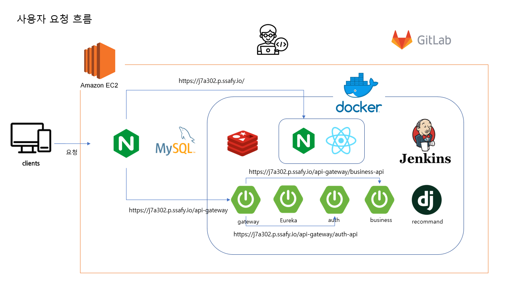

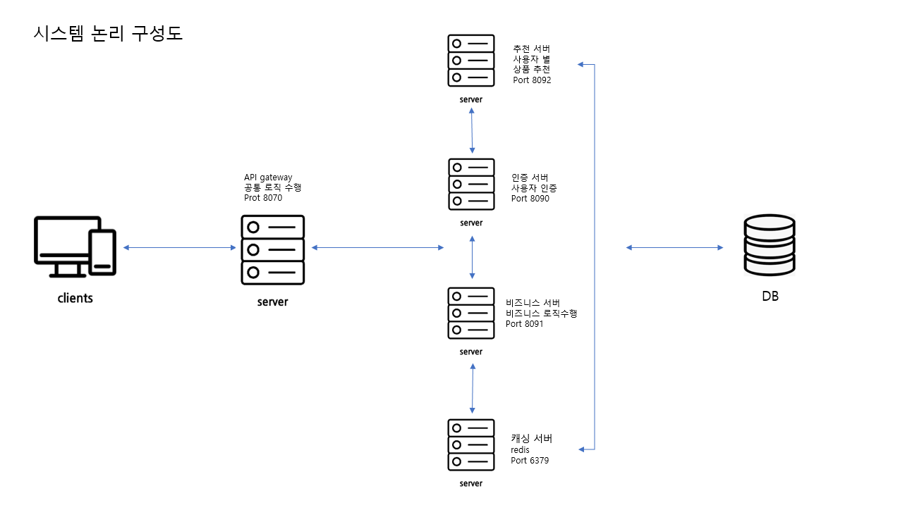

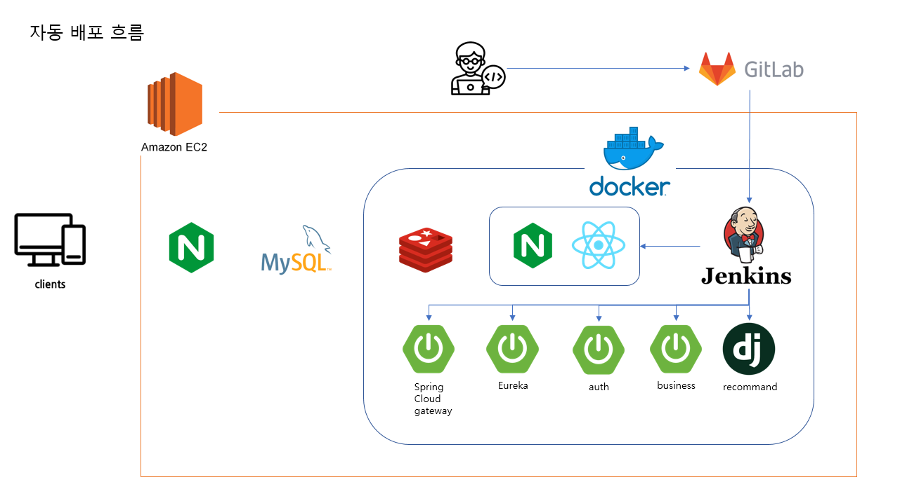

### 📂 파일 구조

**Front-End**

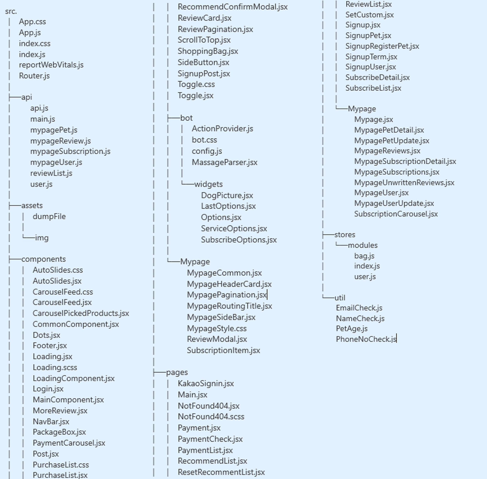

**Back-End**

## 🔗****Database Modeling****

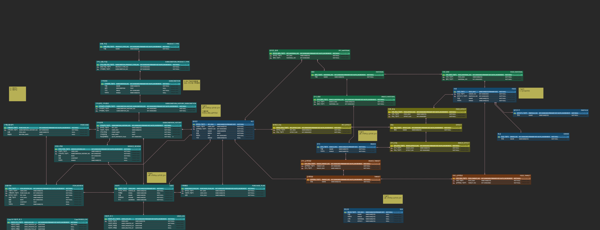

## 🎉****추천 알고리즘****

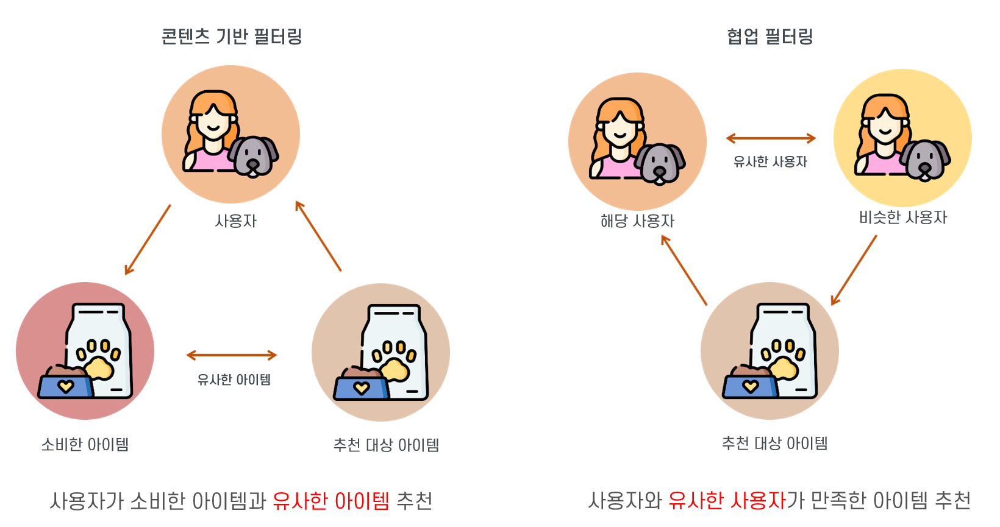

### 콘텐츠 기반 필터링

#### **TF-IDF**

- 단어의 빈도와 그 단어가 얼마나 데이터의 특징을 잘 나타내는지를 기준으로 유사한 제품 추천

- 크롤링한 상품 리뷰에서 빈번하게 나타나는 단어를 기반으로 유사도 측정

- 동사나 형용사 부사 등 의미가 없는 단어들은 자연어 처리를 통해 사용하지 않음

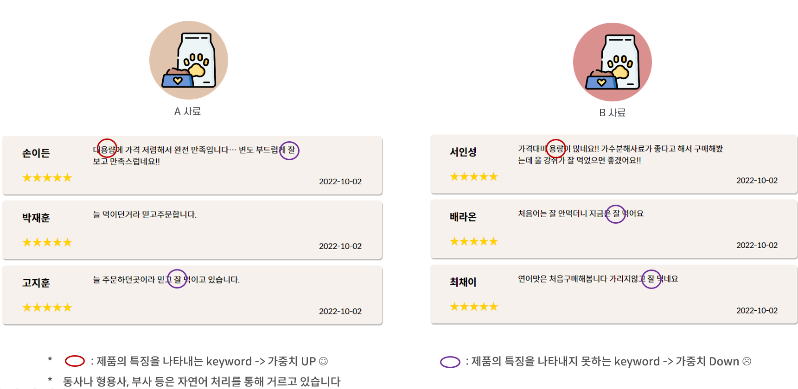

### 협업필터링

#### KNN

- 사용자의 데이터를 좌표로 나타내어 유클리드 거리에 의해 가까운 사용자 그룹화
- 그룹 내의 나와 비슷한 사용자가 만족한 제품을 추천
- 각 제품에 대한 만족도가 축이되어 유사도 거리 측정 척도로 사용됨

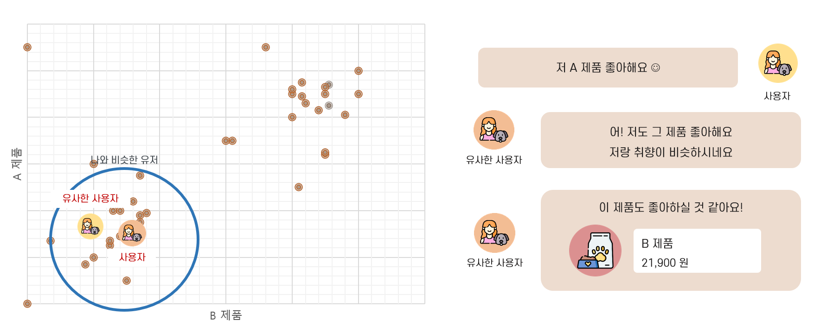

#### SVD

- 나와 비슷한 사용자들의 평점 데이터를 바탕으로 나의 평점을 예측하는 방법
- 예측한 평점이 높은 상품 추천

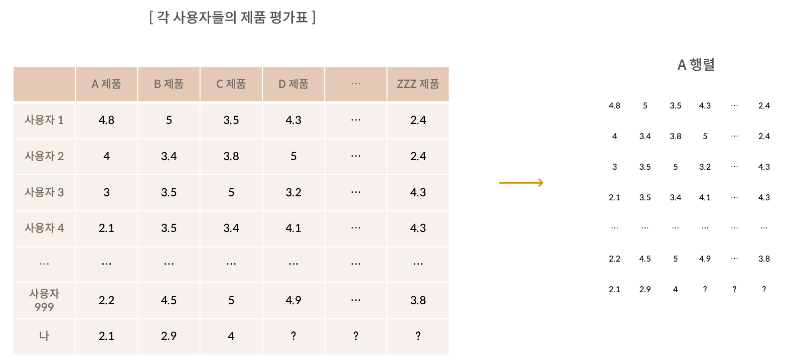

## 💻 주요 기능 및 데모 영상

### **메인페이지**

- 서비스 소개 페이지
-  react-spring을 이용한 애니메이션 효과(첫페이지, 6페이지 숫자)
- 시각적 효과를 위한 세로캐러셀 (버튼 동작)

### 회원가입 및 로그인

- 카카오 로그인
- 회원 가입 시 사용자 정보와 펫 등록
- 펫 3마리까지 등록 가능, 1마리 필수 등록

### 챗봇

- 사이드바 챗봇 버튼 클릭 시 오픈
- 서비스 소개, 추천 알고리즘, 구독 종류 등 서비스 전반에 대한 안내 가능
- 버튼 클릭 혹은 특정 키워드 포함 질문 시 응대 가능
- 응대 불가 질문에는 상담 채널 안내

### 구독 리스트 및 상세 정보

- 각 패키지 리스트 조회 가능
- 원하는 조합의 패키지가 존재하지 않을 때 자유 조합(나만의 패키지) 만들기 가능
- 구독 상세 페이지에서 추천 받을 수 있는 상품 Auto Carousel로 조회 가능

### 장바구니

- 원하는 상품을 장바구니에 담고 남은 쇼핑 가능
- Redux를 사용해 담은 상품 및 대상 반려견 정보를 중앙관리

### 구독 결제

- 6종의 구독 패키지와 나만의 패키지 만들기 중 선택가능
- 구독 상세에 들어가 대상 강아지 선택 후 바로 구독 혹은 장바구니에 담기 가능
- 추천 리스트를 보거나 추천 리스트에서 자동 추천 받아 바로 결제하기로 넘어가기 가능

### 고객 리뷰

- 모든 서비스 리뷰 조회 가능

- 페이지네이션 구현

### 마이페이지

##### 사용자 정보 관리

- 사용자 정보: 이름, 전화번호, 이메일, 전체주소, 상세주소, 우편번호
- 사용자 정보 조회 가능
- 사용자정보 수정 가능 (도로명 주소 우편번호 검색)

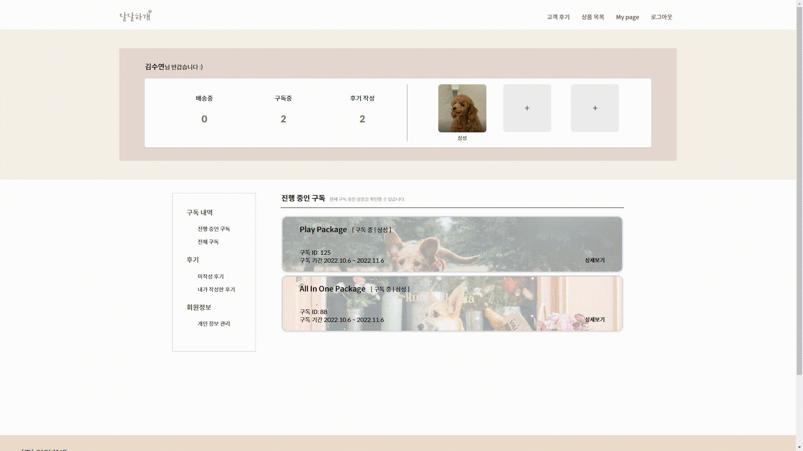

##### 반려견 정보 관리

- 반려견 정보: 이름, 생일, 알러지, 비만도, 선호 사료 기능
- 반려견 정보 조회 가능
- 반려견 정보 수정 가능

##### 펫 추가

- 펫 3마리 미만 등록 시 추가 등록 가능

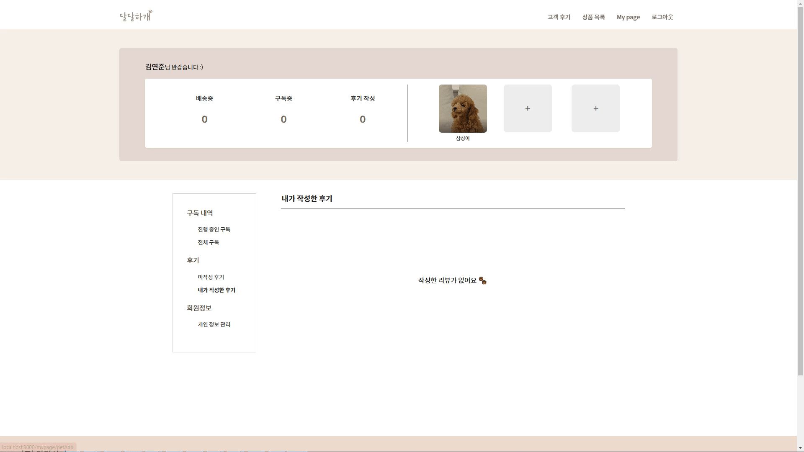

##### 구독정보

- 현재 구독중인, 진행했던 구독 리스트 확인가능
- 구독 상세 정보 확인가능
- 현재 구독중인 상품의 경후 구독 취소(다음 달부터 구독을 진행하지 않음) 가능

##### 리뷰

- 후기 미작성 구독 리스트에서 리뷰 작성 가능 (리뷰 작성 모달)
- 작성 후기 확인 가능

##### 회원 탈퇴

- 회원 탈퇴 가능

## 🎇 기대 효과

##### 1. 간편하게

많은 선택지 중 추천을 통해 선택지는 줄이고 만족도는 높이면서 간편하게 만족스러운 반려견 용품 구입이 가능합니다.

##### 2. 빠르게

기존 인터넷 쇼핑이나 오프라인 쇼핑에서 너무 많은 선택지, 혹은 정보 부족으로 오랜 기간 고민하던 것과 달리 맞춤 추천을 통해 고민의 시간을 줄이고 빠른 쇼핑이 가능합니다.

##### 3. 행복한 반려견

아낀 시간과 기회비용은 우리 반려견을 위해서 사용하여 반려견을 더 행복하게 만들어 줄 수 있습니다

## 🗣️ 협업 관리

**Jira BurnDown Chart**

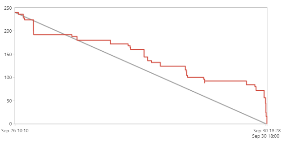

-----

**Notion**

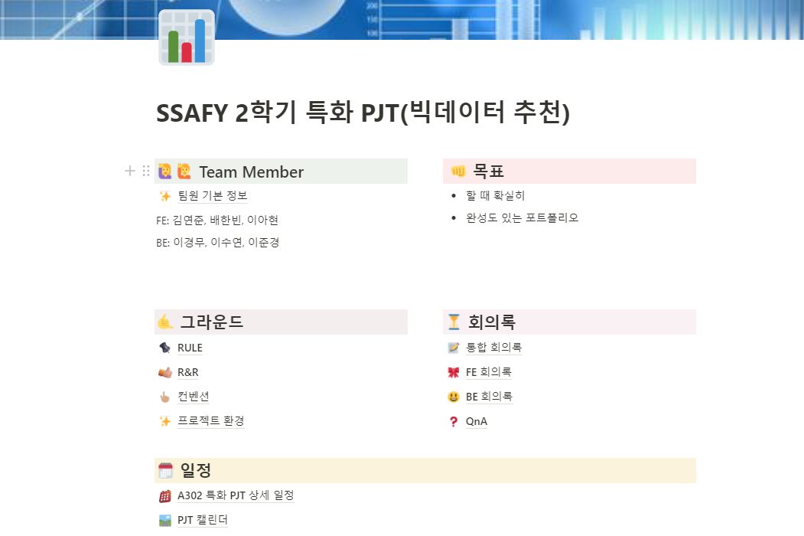

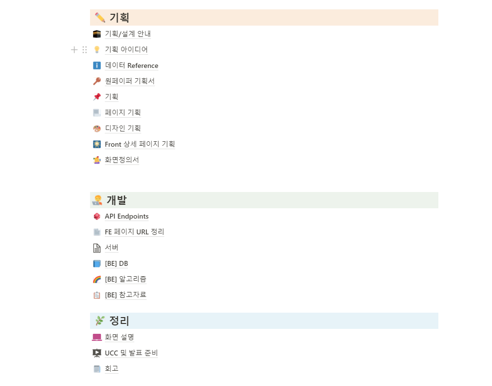

## 👩‍👩‍👧 개발 멤버 소개

## 📅 프로젝트 기간

### 22.08.22 ~ 22.10.07

- **기획 및 설계** : 22.08.22 ~ 22.09.18
- **프로젝트 구현** : 22.09.19 ~ 22.10.02
- **버그 수정 및 산출물 정리** : 22.10.03 ~ 22.10.07
